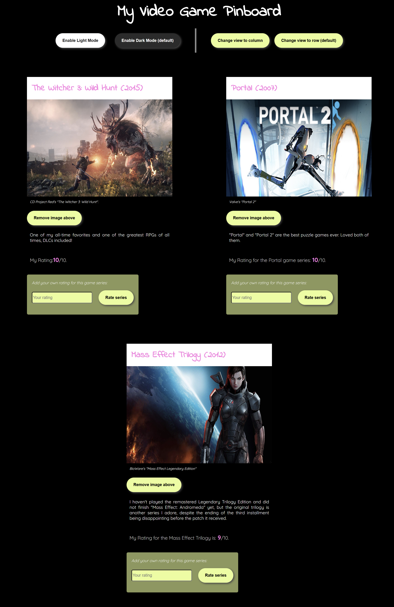
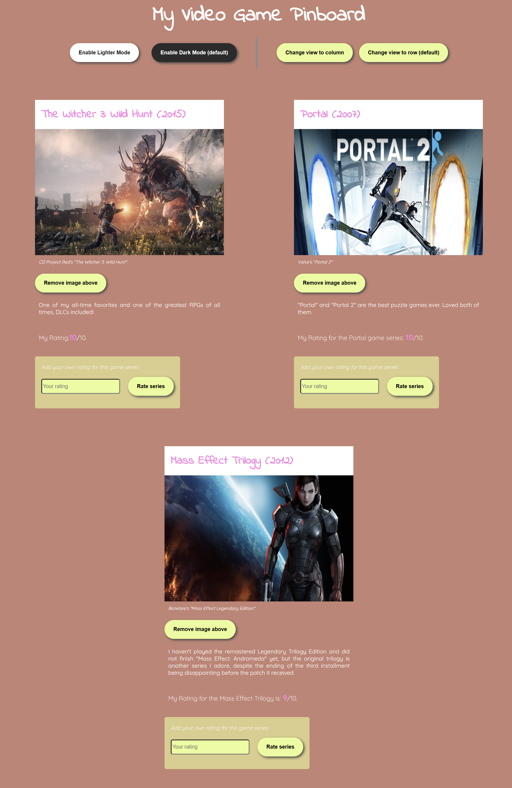

# Assignment 01

## Brief 
Starting from the concept of a pinboard, implement a web page that:

- is responsive (properly layout for smartphone, tablet, and desktop)
- allows the user to add and remove elements
- allows the user to coustomize elements (i.e. colors, size)
- allows the switch between two views (at least)

## Screenshots

## Project Description
This responsive web-pinboard dedicated to three of my favorite videogame series allows users to change from a Light to a Dark Mode. Users can also change the view of the three games from row to column on dekstop screens (because the responsive layout switches automatically to column view for smaller screens to improve the layout's responsiveness).

Users can also remove the image of any game and add the same image back again using two different buttons that are not visibile simultaneously: after removing the image, only the button for adding the image back appears. Conversly, the default button that allows users to remove the game's image appears only when the image is on the page, i.e. after the page is loaded / after the image is back on the page. 

The three videogames can also be rated by users: the rating is then showcased on the page after submitting it. 