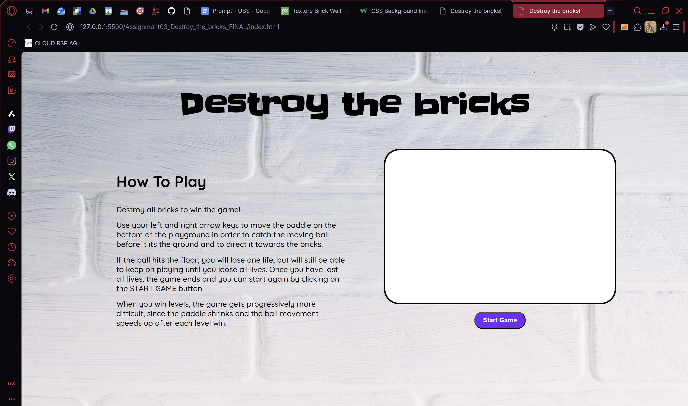
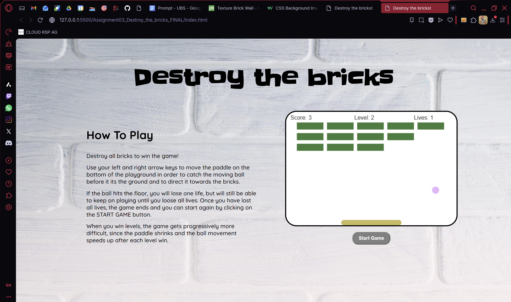

# Assignment 02

## Brief 
Upgrade the **Assignment 02** by adding the use of data coming from an external web API. For example, fetch contents (audio, images, video, text, metadata) from online archives, AI generated contents (chatGPT API), data (weather, realtime traffic data, environmental data).

Have a look at the lesson about the API:

[https://wind-submarine-3d4.notion.site/Lesson-5-200d516637bc811aba69e13b0ffe438f?pvs=74](https://www.notion.so/Lesson-5-200d516637bc811aba69e13b0ffe438f?pvs=21)

The application **must** have those requirements:

- The webpage is responsive
- Use a web API (you choose which one best fists for your project) to load the data and display them in the webpage
- At least one multimedia file (for user feedback interactions, or content itself)
- Develop a navigation system that allows the user to navigate different sections with related content and functionalities

## Screenshots

## Project Description
The goal of this game is to destroy all the bricks that change color after each session, with the ball by letting it bounce off the paddle (whose color also changes) and walls. 

The game keeps track of the score, which increases according to how many bricks have been destroyed. 

The user can control the paddle using the left and right arrow keys. 

Each time the ball touches the floor, the player loses one life, but can continue playing. Once the lives are depleted, the game is over. 

If the user wins, they get to the next level. Difficulty increases with each level, as the paddle schrinks and the ball movement speeds up progressively. 

## Block Diagram

## List of Functions
### Color & Brick Functions
#### fetchColors()
- Description: Fetches random color schemes from The Color API for bricks and paddle.
- Arguments: None.
- Returns: A Promise (from fetch). Updates global BRICK_COLOR and PADDLE_COLOR.

#### drawBricks()
- Description: Draws all bricks on the canvas based on their position and status.
- Arguments: None.
- Returns: Nothing. Draws rectangles on the canvas.

### HUD (Score, Lives, Level)
#### createScore()
- Description: Displays the current player score at the top-left of the canvas.
- Arguments: None.
- Returns: Nothing. Draws text.

#### createLives()
- Description: Displays the remaining player lives at the top-right of the canvas.
- Arguments: None.
- Returns: Nothing. Draws text.

#### createLevel()
- Description: Displays the current level number at the top-center of the canvas.
- Arguments: None.
- Returns: Nothing. Draws text.

### Collision & Game Logic
#### collisionDetection()
- Description: Checks if the ball collides with any active brick. Updates score, brick status, and triggers level win if all bricks are cleared.
- Arguments: None.
- Returns: Nothing. Updates global state (PLAYER_SCORE, levelWin, winTimer).

### Ball & Paddle Drawing
#### drawBall()
- Description: Draws the ball at its current position.
- Arguments: None.
- Returns: Nothing. Draws a circle on the canvas.

#### drawPaddle()
- Description: Draws the paddle at its current position.
- Arguments: None.
- Returns: Nothing. Draws a rounded rectangle on the canvas.

### Level & State Management
#### nextLevel()
- Description: Advances to the next level. Resets ball position, increases ball speed, shrinks paddle, resets bricks, and fetches new colors.
- Arguments: None.
- Returns: Nothing. Updates global state.

### Messages
#### drawLevelWin()
- Description: Displays a “YOU WIN LEVEL X!” message centered on the canvas.
- Arguments: None.
- Returns: Nothing. Draws text.

#### drawGameOver()
- Description: Displays a “GAME OVER!” message centered on the canvas and plays a sound.
- Arguments: None.
- Returns: Nothing. Draws text and plays audio.

### Main Game Loop
#### draw()
- Description: Main rendering and game logic loop. Clears canvas, draws bricks, ball, paddle, checks collisions, handles ball movement, paddle movement, win/game over states, and updates HUD.
- Arguments: None.
- Returns: Nothing. Continuously updates canvas and global state.

### Input Handlers
#### keyDownHandler(e)
- Description: Handles key press events. Sets flags for left/right arrow keys.
- Arguments: e (KeyboardEvent).
- Returns: Nothing. Updates global flags (BTN_PRESSED_LEFT, BTN_PRESSED_RIGHT).

#### keyUpHandler(e)
- Description: Handles key release events. Resets flags for left/right arrow keys.
- Arguments: e (KeyboardEvent).
- Returns: Nothing. Updates global flags.

### Game Start
#### startGame()
- Description: Initializes game state (lives, level), fetches colors, attaches event listeners, and starts the game loop.
- Arguments: None.
- Returns: Nothing. Starts interval loop (INTERVAL = setInterval(draw, 10)).

## API
[add link ](https://www.thecolorapi.com)
An open source, free-to-use API for fetching random color schemes and random single colors. 